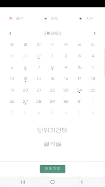
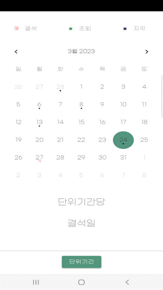

# AttendanceApp

국비교육은 단위기간동안 80%이상을 출결해야만 훈련장려금이 지급된다. 

HRD-Net이라는 어플로 출석확인을 하지만 단위기간당 출결상황은 알 수 없다. 즉 단위기간별 지각·조퇴 , 결석을 알 수 없다.

그래서 단위기간별 나의 출결을 알기 위해 만들었다.

   

## 기능
- 달력에 지각 , 조퇴 , 결석 을 표시 할 수 있다.
  - 지각은 파랑 , 조퇴는 초록 , 결석은 빨강으로 표시된다.
  - 삭제 혹은 수정 가능하다.
- 지각과 조퇴는 3번 누적시 1번의 결석으로 계산된다. 
- 2/19 부터 6/28까지 즉 2회차~6회차까지의 회차별 출결을 체크 할 수 있다.
  - 2회차부터 만들어서 사용해서 1회차는 버튼조차 구현하지 않았다.

   
  
## 시현 영상
### 지각 조퇴 결석 표시
</img> 
 

### 지각 조퇴 결석 수정과 삭제
</img> 
 

### 회차별 결석일수 확인
</img> 

   

## 개발 도구 
Android Studio

   

## DB저장방식
이 어플은 DB가 많은 저장공간을 필요로 하지 않기 때문에 SQLiteDatabase로 디바이스 내부에 DB를 저장했다. 

- DB 구조
date_sel(text타입) 이라는 하나의 column으로 이루어진 mytable이라는 table 

- 저장되는 내용 : 날짜-출결번호
  - 날짜 : CalendarDay{2023-3-7} 
  - 출결번호 : 1=결석 , 2=조퇴 , 3=지각

<table>
  <tr>
    <td>CalendarDay{2023-3-7}-1</td>
  </tr>
   <tr>
    <td>CalendarDay{2023-3-8}-3</td>
  </tr>
  <tr>
    <td>CalendarDay{2023-2-14}-2</td>
  </tr>
</table>
